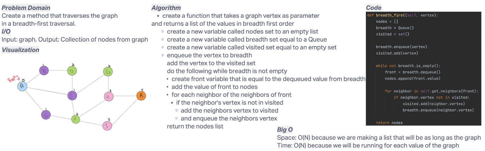

# Challenge Summary
Create a method in the graph file that allows for breadth search traversal of a graph.

## Whiteboard Process

## Approach & Efficiency
I took the approach of using a queue along with a set and list to keep track of current values, past values
and nodes.
