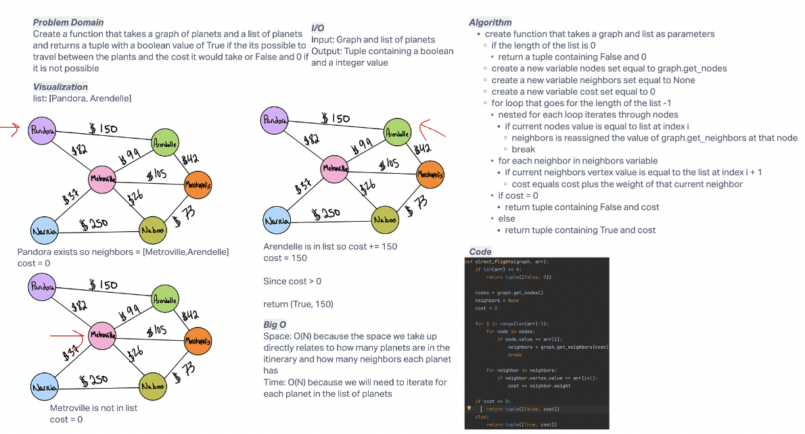

# Challenge Summary
Create a function that takes a graph of planets and a list of planets
and returns a tuple with a boolean value of True if the its possible to
travel between the plants and the cost it would take or False and 0 if it is not possible
## Whiteboard Process

## Approach & Efficiency
I took the approach of doing it iteratively. First checking if the list is empty and if not iterating through that list,
checking its neighbors, and comparing its neighbors to the next value in the list
