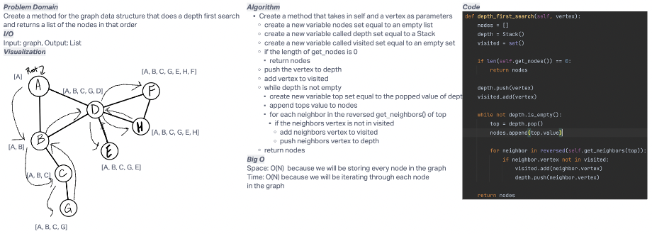

# Challenge Summary
Create a method for the graph data structure that does a depth first search
and returns a list of the nodes in that order.
## Whiteboard Process

## Approach & Efficiency
I took the approach of using a stack and adding each removed stack item to the nodes list
