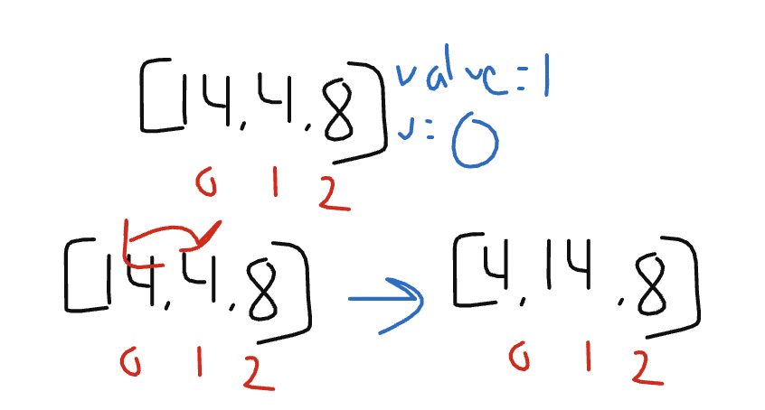
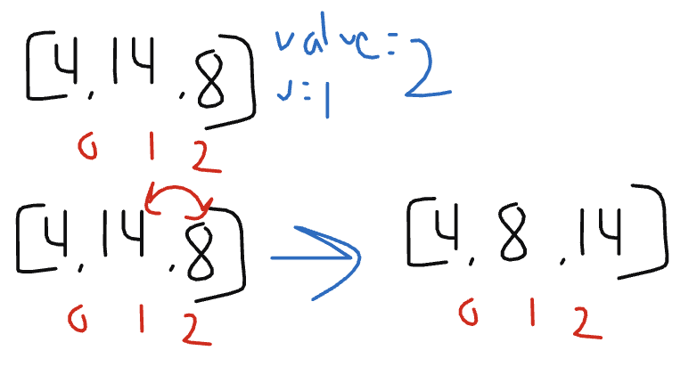

# Blog Notes: Insertion Sort
Selection Sort is an algorithm that traverses a list multiple times. Each iteration of the traversal slowly
sorts the list. This is done by keeping track of the minimum value and placing it in the very front of the
list until it is fully sorted.

## Pseudocode
* Create a function called selection_sort that takes a list as an argument
  * print out the original list
  * for loop that starts with i at 1 rather than 0
    * create a new variable called value set equal to list at index i
    * create a new variable called j set equal to i minus 1
    * create while loop that goes while j is greater than/equal to 0 and value is greater than value at index j
      * list at index j+1 equals list at index j
      * j equals j minus 1
  * print out the new sorted list

## Trace
Sample List: [14, 4, 8]

* Pass 1:

  * In the first traversal of this function, we compare the number at index 1 to the number at the index before it, index 0. Since it is less than the number at index 0 they swap places.
* Pass 2:

  * In the second traversal of this function, we compare the number at index 2 to the number at the index before it, index 1. Since it is less than the value they swap positions
  * Now there are still values before it so we check if it is less than the value at the index before its new positioning. It is not less than it, so it stays in place and breaks out.

## Efficiency
* Time: O(N^2)
  * Because we are comparing, this function will happen n * (n-1) times
* Space: O(1):
  * Since we are just reordering the list we were given, no additional space is needed.
