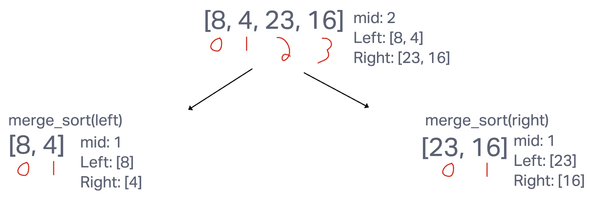

# Blog Notes: Merge Sort
Merge Sort is an algorithm that recursively breaks a list into two halves.The left side being from index 0 to the index just before the middle index. The right side being from the middle index to the end index. It then calls a helper function Merge which compares the two values and adds the lower value to the original list.

## Pseudocode
* Create a function called merge_sort that takes a list as a parameter
  * create a variable length and set it equal to the length of the list
  * if length is greater than 1
    * create variable mid that is equal to the floored division of length
    * create a left variable which is a list of values starting at index 0 going to 1 before the mid index of list
    * create a right variable which is a list of values starting at the mid index of the list going until the last index
    * recursively call merge_sort on the left list
    * recursively call merge_sort on the right list
    * call helper function merge with the parameters left, right, and list
  * return list
* Create a helper function called merge which takes in a left, right , and list as parameters (all of these are lists)
  * create three variables, i, j, and k, all set equal to 0
  * while i is less than the length of left and j is less than the len of right
    * if left at index i is less than or equal to right at index j
      * list at index k equals left at index i
      * i equals i + 1
    * else
      * list at index k equals right at index j
      * j = j + 1
    * k equals k + 1
  * if i is equal to the length of left
    * list after index k is equal to right after index j
  * else
    * list after index k is equal to right after index i

## Trace
Sample List: [8, 4, 23, 16]
* Pass 1:

  * In the first pass we split the list in half at index 2 and creating two new lists of the right and left of the mid. Then we recursively call merge_sort on the left or right.
* Pass 2:

  * In the second pass we are following the recursive call of merge_sort(left) and see that it gives us two lists with only 1 value in it. This is when our helper function merge will come in and sort these back into the original list.
* Pass 3:

  * In the third pass we are following the recursive call of merge_sort(right) and see that it gives us two lists with only 1 value in it. This is when our helper function merge will come in and sort these back into the original list.

